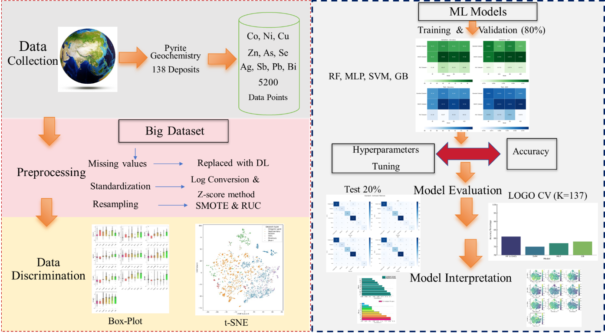

# Artificial Intelligence-Driven Metallogenic Typing of Pyrite from Global Ore Systems

[](https://doi.org/10.1016/j.gexplo.2026.108138)


This repository supports the article:

> Gul, M.A. et al. (2026). Artificial intelligence-driven metallogenic typing of pyrite from global ore systems. Journal of Geochemical Exploration, 289, 108138.  
> https://doi.org/10.1016/j.gexplo.2026.108138

The repository provides a public-safe, reproducible machine-learning workflow for metallogenic typing of pyrite trace-element geochemistry from global ore systems.

---

## Graphical Abstract


---

## Overview

Pyrite is one of the most common sulfide minerals in ore systems and sedimentary environments. Its trace-element composition can preserve information about ore-fluid source, temperature, physicochemical conditions, metal budget, and metallogenic environment. However, traditional two-element and ternary discrimination diagrams commonly fail because pyrite from different ore systems can show strong compositional overlap.

This study develops an AI-driven metallogenic typing framework that classifies pyrite from global ore systems using multielement LA-ICP-MS trace-element data, supervised machine-learning models, class-balancing experiments, blind testing, deposit-scale validation, and interpretable geochemical analysis.

---

## Key scientific innovations

- Global pyrite geochemical framework for metallogenic typing across major ore-system classes.
- Large multideposit compilation of pyrite LA-ICP-MS spot analyses from global deposits and stratigraphic settings.
- Multielement AI classification using Co, Ni, Cu, Zn, Se, Ag, Sb, Pb, Bi, and As.
- Direct comparison of four supervised ML models: Random Forest, Support Vector Machine, Gradient Boosting, and Multilayer Perceptron.
- Class-imbalance assessment using standard data, SMOTE oversampling, and RUC/RUS-style undersampling.
- Blind test evaluation using independent test splits.
- Deposit-scale LOGO cross-validation to reduce overoptimistic performance caused by samples from the same deposit being split across training and testing sets.
- Explainable geochemical interpretation through feature importance, permutation importance, t-SNE visualization, box plots, and confusion-matrix analysis.
- Interactive web application for pyrite deposit-type prediction.

---

## Dataset summary

| Item | Description |
|---|---|
| Mineral | Pyrite |
| Analytical method | LA-ICP-MS trace-element geochemistry |
| Approximate dataset size | ~5200 pyrite spot analyses |
| Deposits / settings | 138 global deposits and stratigraphic settings |
| Classes | Orogenic gold, VMS, SEDEX, Porphyry, Skarn, Sedimentary/Barren pyrite |
| Feature elements | Co, Ni, Cu, Zn, Se, Ag, Sb, Pb, Bi, As |
| Target variable | Deposit type / metallogenic class |
| Public data status | Full compiled dataset is not included in this public-safe release; see DATA_ACCESS.md |

---

## Methodological workflow



---

## Machine-learning models

| Model | Role in the study |
|---|---|
| Random Forest | Tree-based ensemble model and feature-importance interpretation |
| Support Vector Machine | Non-linear classification in high-dimensional geochemical space |
| Gradient Boosting | Boosted ensemble model for complex nonlinear trace-element patterns |
| Multilayer Perceptron | Neural-network classifier for nonlinear multielement relationships |

---

## Resampling strategy

Class imbalance is a major challenge in global mineral-geochemistry datasets because some deposit classes naturally have many more analyses than others. This repository documents three dataset strategies:

| Dataset strategy | Purpose |
|---|---|
| Standard dataset | Original class distribution used as the baseline |
| SMOTE dataset | Synthetic Minority Over-Sampling Technique used to improve minority-class learning |
| RUC/RUS-style undersampling | Majority-class reduction used to test the effect of balanced but information-reduced training data |

Important note: the current uploaded notebooks implement RandomUnderSampler from imbalanced-learn. If the final manuscript wording uses strict RUC / cluster-based undersampling, this repository should either implement the exact cluster-based approach or consistently describe the implementation as RUS-style undersampling.

---

## Model validation strategy

The workflow evaluates model performance using:

- validation accuracy
- test accuracy
- AUC / ROC-AUC
- precision, recall, and F1-score
- confusion matrices
- blind testing
- LOGO cross-validation at deposit scale
- feature-importance and permutation-importance analysis
- t-SNE visualization of deposit-type separation

The LOGO design is especially important because pyrite datasets often contain multiple analyses from the same deposit. Holding out one deposit at a time gives a more realistic test of generalization to unseen geological systems.

---

## Reported performance summary


The study reports that SMOTE-balanced learning produced the strongest overall validation/test performance, with SVM and MLP reaching the highest accuracy range and very high AUC values.

| Dataset | Strongest validation accuracy | Strongest test accuracy | General interpretation |
|---|---:|---:|---|
| Standard | SVM ~93.09% | SVM ~92.99% | Strong baseline performance |
| SMOTE | SVM ~97.68% | SVM/MLP ~97.7% / ~97.6% | Best overall accuracy and AUC |
| RUC/RUS-style undersampling | SVM/MLP/GB ~85-86% | GB/RF ~84-85% | Lower performance due to majority-class information loss |

---

## Geological interpretation

The AI results are not only predictive; they also provide geochemical insight. Feature-ranking and t-SNE analyses show that elements such as Ni, Pb, Sb, Se, Cu, and As contribute strongly to pyrite metallogenic discrimination. These elements reflect differences in temperature, ore-fluid source, metal availability, sulfide partitioning, and sedimentary versus hydrothermal controls.

The approach helps overcome limitations of traditional Co-Ni and As-Co-Ni diagrams, where different pyrite genetic classes show substantial compositional overlap.

---

## Interactive web application

An interactive web application accompanies the study and allows users to upload pyrite trace-element compositions and predict metallogenic class using the trained ML workflow.

Launch app:

https://huggingface.co/spaces/DrAmar/Pyrite_Discrimination

The input Excel sheet should follow the same feature-column sequence as the modelling dataset.

---

## Repository structure

```text
.
|-- data/
|   |-- raw/                         # Raw compilation; not included in public-safe release
|   `-- processed/                   # Standardized input data; private release only
|-- notebooks/
|   |-- 00_log_transform_and_standardize.ipynb
|   |-- 01_preprocessing_and_model_checks.ipynb
|   |-- 02_random_forest.ipynb
|   |-- 03_support_vector_machine.ipynb
|   |-- 04_gradient_boosting.ipynb
|   |-- 05_multilayer_perceptron.ipynb
|   `-- 06_model_performance_heatmaps.ipynb
|-- reports/
|   `-- figures/
|       |-- graphical_abstract.jpg
|       |-- methods_workflow.png
|       `-- model_performance_heatmaps_4panel.png
|-- src/
|   `-- pyrite_typing/
|       |-- __init__.py
|       `-- config.py
|-- requirements.txt
|-- environment.yml
|-- CITATION.cff
|-- DATA_ACCESS.md
|-- REPRODUCIBILITY_NOTES.md
`-- github_setup_commands.md
```

---

## Quick start

### 1. Clone repository

```bash
git clone https://github.com/Dr-Amar/Pyrite-AI-metallogenic-typing.git
cd Pyrite-AI-metallogenic-typing
```

### 2. Create Python environment

```bash
python -m venv .venv
source .venv/bin/activate
pip install -r requirements.txt
```

Windows:

```bash
.venv\Scripts\activate
pip install -r requirements.txt
```

Or with conda:

```bash
conda env create -f environment.yml
conda activate pyrite-typing
```

### 3. Add data

Place the standardized input file here:

```text
data/processed/Pyrite_Standarized_data_file_New_Paper.xlsx
```

For a public repository, do not upload the full compiled dataset unless all co-author, publisher, and source-data permissions are clear.

### 4. Run notebooks

```bash
jupyter lab
```

Suggested execution order:

1. 00_log_transform_and_standardize.ipynb
2. 01_preprocessing_and_model_checks.ipynb
3. 02_random_forest.ipynb
4. 03_support_vector_machine.ipynb
5. 04_gradient_boosting.ipynb
6. 05_multilayer_perceptron.ipynb
7. 06_model_performance_heatmaps.ipynb

---

## Data availability

This public-safe repository does not include the full standardized Excel dataset. The article states that data will be made available on request. See DATA_ACCESS.md for data-access guidance.

---

## Citation

Please cite the article if you use this workflow:

```bibtex
@article{Gul2026PyriteMetallogenicTyping,
  title   = {Artificial intelligence-driven metallogenic typing of pyrite from global ore systems},
  author  = {Gul, Muhammad Amar and Kanwal, Asia and Faisal, Mohamed and Zafar, Tehseen and Awan, Rizwan Sarwar and Akhtar, Shamim and Khan, Ibrar and Yang, Xiaoyong},
  journal = {Journal of Geochemical Exploration},
  volume  = {289},
  pages   = {108138},
  year    = {2026},
  doi     = {10.1016/j.gexplo.2026.108138}
}
```

---

## License

This repository includes an MIT license for code. Data-sharing permissions should be reviewed before public release of the compiled geochemical dataset.
