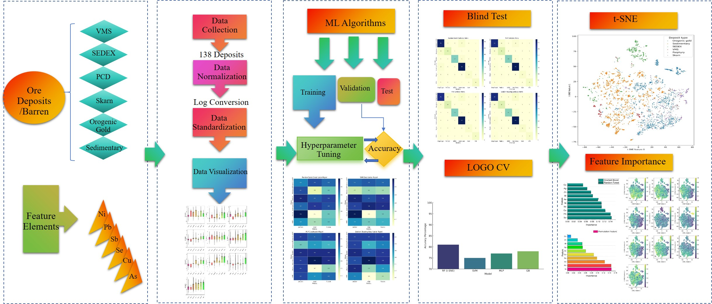
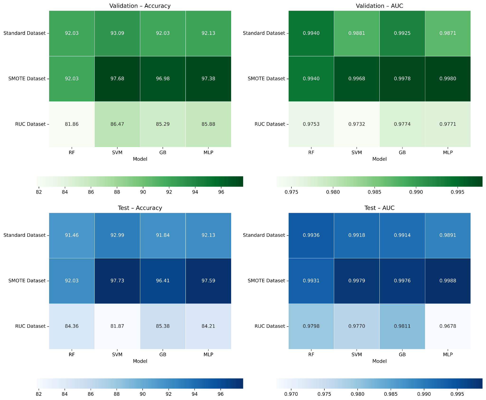

# Artificial Intelligence-Driven Metallogenic Typing of Pyrite

[](https://doi.org/10.1016/j.gexplo.2026.108138)
[](https://www.sciencedirect.com/journal/journal-of-geochemical-exploration)
[](https://www.python.org/)
[](LICENSE)
[](https://huggingface.co/spaces/DrAmar/Pyrite_Discrimination)

Public-safe repository for the paper:

> **Gul, M.A. et al. (2026). Artificial intelligence-driven metallogenic typing of pyrite from global ore systems.**  
> *Journal of Geochemical Exploration*, 289, 108138.  
> https://doi.org/10.1016/j.gexplo.2026.108138

This repository provides a reproducible machine-learning workflow for classifying pyrite trace-element geochemistry from global ore systems. It is designed to support transparent reuse of the modelling pipeline while keeping the compiled dataset private unless data-sharing permissions are clear.

---

## Graphical Abstract



---

## Overview

Pyrite is one of the most common sulfide minerals in ore systems and sedimentary environments. Its trace-element composition can preserve information about ore-fluid source, temperature, physicochemical conditions, metal budget, and metallogenic environment. However, traditional two-element or ternary discrimination diagrams often fail because pyrite from different systems can show strong compositional overlap.

This project addresses that limitation using **multivariate machine learning**. The workflow integrates pyrite LA-ICP-MS trace-element data, data preprocessing, class balancing, supervised classification, feature-importance analysis, t-SNE visualization, and deposit-scale validation.

---

## Why this study matters

Conventional pyrite discrimination commonly relies on limited bivariate or ternary plots such as Co–Ni or As–Co–Ni. These diagrams are useful for first-pass interpretation but are not sufficiently powerful when ore systems overlap geochemically.

This study improves metallogenic typing by using the full multielement geochemical signature of pyrite and evaluating multiple machine-learning algorithms under different resampling and validation strategies.

---

## Key scientific innovations

| Innovation | Description |
|---|---|
| **Global pyrite metallogenic framework** | Uses a large global compilation of pyrite LA-ICP-MS analyses across major ore-system classes. |
| **Multielement classification** | Moves beyond simple Co–Ni or ternary discrimination by using ten trace-element predictors. |
| **Class-imbalance treatment** | Compares original, oversampled, and undersampled datasets to evaluate how resampling affects model performance. |
| **Multiple ML algorithms** | Benchmarks Random Forest, Support Vector Machine, Gradient Boosting, and Multilayer Perceptron models. |
| **Deposit-scale validation** | Uses Leave-One-Group-Out cross-validation to reduce overoptimistic performance caused by repeated analyses from the same deposit. |
| **Explainable geochemistry** | Uses feature importance, permutation importance, and t-SNE visualization to connect model behavior with geological processes. |
| **Interactive prediction app** | Provides a user-facing web application for pyrite deposit-type prediction. |

---

## Dataset summary

| Attribute | Description |
|---|---|
| Mineral | Pyrite |
| Analytical method | LA-ICP-MS trace-element geochemistry |
| Approximate dataset size | Nearly 5200 pyrite spot analyses |
| Number of deposits/settings | 138 |
| Deposit/system classes | Orogenic Au, VMS, SEDEX, Porphyry, Skarn, Barren/Sedimentary pyrite |
| Feature elements | Co, Ni, Cu, Zn, Se, Ag, Sb, Pb, Bi, As |
| Target variable | Deposit type / metallogenic class |

### Feature set

```text
Co, Ni, Cu, Zn, Se, Ag, Sb, Pb, Bi, As
```

### Target classes

```text
Orogenic Au
Volcanogenic massive sulfide (VMS)
Sedimentary exhalative (SEDEX)
Porphyry
Skarn
Barren / sedimentary pyrite
```

---

## Methodological workflow

```text
Global pyrite LA-ICP-MS compilation
        │
        ▼
Data screening and feature selection
        │
        ▼
Missing-value treatment
        │
        ▼
Log transformation
        │
        ▼
Z-score standardization
        │
        ▼
Class-balancing experiments
  ┌──────────────┬───────────────┬────────────────────┐
  │ Standard data │ SMOTE data    │ RUC/RUS-style data │
  └──────────────┴───────────────┴────────────────────┘
        │
        ▼
ML model training and hyperparameter tuning
  ┌──────────────┬──────────────┬──────────────┬──────────────┐
  │ Random Forest │ SVM-RBF      │ Gradient Boosting │ MLP       │
  └──────────────┴──────────────┴──────────────┴──────────────┘
        │
        ▼
Model evaluation
Accuracy • ROC-AUC • Precision • Recall • F1-score • Confusion matrix
        │
        ▼
Deposit-scale LOGO validation
        │
        ▼
Feature importance + t-SNE geological interpretation
        │
        ▼
Interactive web application
```

---

## Machine-learning models

| Model | Role in workflow | Strength |
|---|---|---|
| **Random Forest (RF)** | Ensemble tree-based classifier | Robust to nonlinear geochemical relationships and useful for feature importance. |
| **Support Vector Machine (SVM)** | RBF-kernel classifier | Strong performance in high-dimensional nonlinear decision spaces. |
| **Gradient Boosting (GB)** | Sequential ensemble classifier | Captures complex interactions and improves weak learners iteratively. |
| **Multilayer Perceptron (MLP)** | Neural-network classifier | Learns nonlinear multielement patterns across deposit classes. |

---

## Data preprocessing

The modelling workflow applies standard geochemical preprocessing steps:

1. **Data screening** to retain elements with suitable completeness across studies and samples.
2. **Missing-value handling** using detection-limit based replacement where appropriate.
3. **Log transformation** to reduce strong right-skewness in trace-element concentration data.
4. **Z-score standardization** so that each element contributes comparably during model training.
5. **Random shuffling** before model training to reduce order-related bias.

---

## Resampling strategy

Ore-deposit datasets are naturally imbalanced because some deposit types are more frequently sampled or more abundant in the literature. Without class balancing, ML models can become biased toward majority classes and underperform on rarer but geologically important systems.

This study compares three modelling scenarios:

| Dataset scenario | Purpose | Expected effect |
|---|---|---|
| **Standard dataset** | Original class distribution | Baseline performance without synthetic balancing. |
| **SMOTE oversampling** | Generates synthetic minority-class samples | Improves minority-class recognition and reduces majority-class bias. |
| **RUC / RUS-style undersampling** | Reduces majority-class dominance | Tests balanced learning with fewer majority-class examples, but may lose useful information. |

### Important note on undersampling terminology

The manuscript describes **Random Undersampling with Clustering (RUC)**. Some public notebooks may currently use `RandomUnderSampler` from `imbalanced-learn`, which is closer to **random undersampling (RUS)**. For strict manuscript reproducibility, the repository should either:

1. implement the exact cluster-based RUC procedure, or  
2. clearly label the notebook method as RUS-style undersampling.

This note is included to keep the public repository transparent and scientifically auditable.

---

## Validation strategy

The study evaluates model performance at two levels:

### 1. Sample-level validation and test performance

Models are evaluated using:

- Accuracy
- ROC-AUC
- Precision
- Recall
- F1-score
- Confusion matrices

### 2. Deposit-scale Leave-One-Group-Out cross-validation

LA-ICP-MS datasets often contain many spot analyses from the same deposit. If spot analyses from one deposit appear in both training and test sets, performance can be overestimated because the model has already seen very similar geochemical signatures.

To address this, the workflow applies **Leave-One-Group-Out cross-validation (LOGO CV)**:

- each deposit is treated as one group,
- one complete deposit is held out during each iteration,
- the model trains on the remaining deposits,
- the held-out deposit is predicted as unseen data,
- majority voting is used to assign the final deposit-level class.

This makes the validation more realistic for exploration scenarios where a new deposit must be classified from previously unseen pyrite geochemistry.

---

## Reported performance summary



The study shows that SMOTE-balanced modelling generally produced the strongest validation and test performance. MLP and SVM achieved the highest accuracy/AUC values in the strongest cases, while RUC/RUS-style undersampling generally reduced performance due to information loss from majority-class reduction.

| Evaluation | Main result |
|---|---|
| **Best validation performance** | SMOTE models produced the highest validation accuracy and AUC overall. |
| **Best test performance** | SVM and MLP achieved the strongest test accuracy range on SMOTE data. |
| **RUC/RUS-style models** | Lower performance than SMOTE, consistent with information loss during undersampling. |
| **LOGO validation** | Deposit-scale validation showed that the models retained meaningful predictive ability on unseen deposits. |
| **Geological consistency** | Feature importance and t-SNE patterns are consistent with known metallogenic controls on pyrite chemistry. |

---

## Geochemical interpretation and explainable AI

The model interpretation links statistical classification with ore-forming processes.

### Important elements

Feature-importance and permutation analyses highlight the role of elements such as:

```text
Ni, Pb, Sb, Se, Cu, As, Bi, Zn, Ag, Co
```

Different elements contribute differently to discrimination:

- **Pb, As, Zn, Sb** can be important in sedimentary and SEDEX-related hydrothermal systems.
- **Co and Se** can help distinguish higher-temperature or magmatic/hydrothermal influence, especially in VMS-related systems.
- **Ni, Pb, and Sb** emerge as strong discriminators in permutation-based ranking.
- **Se, Pb, Cu, Sb, Ni, and As** are important in tree-based feature ranking.

### Geological controls captured by the models

The ML models capture multielement patterns related to:

- ore-fluid source,
- temperature,
- metal budget,
- host-rock and sedimentary influence,
- magmatic versus non-magmatic hydrothermal contribution,
- trace-element partitioning into co-precipitating sulfides.

---

## Interactive web application

An interactive web application accompanies the study and allows users to test pyrite geochemical compositions against the trained classification framework.

**Launch the app:**  
https://huggingface.co/spaces/DrAmar/Pyrite_Discrimination

The application is intended for rapid research and exploration screening. Input data should follow the same feature structure used in the study.

---

## Repository structure

```text
.
├── data/
│   └── README.md                         # Data-access information; dataset not included publicly
├── models/
│   └── README.md                         # Placeholder for trained/private models
├── notebooks/
│   ├── 00_log_transform_and_standardize.ipynb
│   ├── 01_preprocessing_and_model_checks.ipynb
│   ├── 02_random_forest.ipynb
│   ├── 03_support_vector_machine.ipynb
│   ├── 04_gradient_boosting.ipynb
│   ├── 05_multilayer_perceptron.ipynb
│   └── 06_model_performance_heatmaps.ipynb
├── outputs/
│   └── README.md                         # Output folder placeholder
├── reports/
│   └── figures/
│       ├── graphical_abstract.jpg
│       └── model_performance_heatmaps_4panel.png
├── src/
│   └── pyrite_typing/
│       ├── __init__.py
│       └── config.py
├── CITATION.cff
├── DATA_ACCESS.md
├── REPRODUCIBILITY_NOTES.md
├── environment.yml
├── requirements.txt
├── LICENSE
└── README.md
```

---

## Quick start

### 1. Clone the repository

```bash
git clone https://github.com/Dr-Amar/Pyrite-AI-metallogenic-typing.git
cd Pyrite-AI-metallogenic-typing
```

### 2. Create a Python environment

Using `venv`:

```bash
python -m venv .venv

# Windows
.venv\Scripts\activate

# macOS/Linux
source .venv/bin/activate

pip install -r requirements.txt
```

Or using conda/mamba:

```bash
conda env create -f environment.yml
conda activate pyrite-typing
```

### 3. Add the dataset

The public-safe release does **not** include the compiled Excel dataset.

Place the private standardized file here if you have permission to use it:

```text
data/processed/Pyrite_Standarized_data_file_New_Paper.xlsx
```

For public release, do not upload the full compiled dataset unless co-author, publisher, and source-data permissions are clear.

### 4. Run notebooks

Open JupyterLab:

```bash
jupyter lab
```

Suggested execution order:

1. `notebooks/00_log_transform_and_standardize.ipynb`
2. `notebooks/01_preprocessing_and_model_checks.ipynb`
3. `notebooks/02_random_forest.ipynb`
4. `notebooks/03_support_vector_machine.ipynb`
5. `notebooks/04_gradient_boosting.ipynb`
6. `notebooks/05_multilayer_perceptron.ipynb`
7. `notebooks/06_model_performance_heatmaps.ipynb`

---

## Data availability

The repository is intentionally **public-safe**. The full compiled dataset is not distributed in this public release. Data access should follow the manuscript statement and any applicable co-author, publisher, and source-study permissions.

For details, see:

- [`DATA_ACCESS.md`](DATA_ACCESS.md)
- [`REPRODUCIBILITY_NOTES.md`](REPRODUCIBILITY_NOTES.md)

---

## Recommended citation

If you use this workflow, please cite the article:

```bibtex
@article{Gul2026PyriteMetallogenicTyping,
  title   = {Artificial intelligence-driven metallogenic typing of pyrite from global ore systems},
  author  = {Gul, Muhammad Amar and Kanwal, Asia and Faisal, Mohamed and Zafar, Tehseen and Awan, Rizwan Sarwar and Akhtar, Shamim and Khan, Ibrar and Yang, Xiaoyong},
  journal = {Journal of Geochemical Exploration},
  volume  = {289},
  pages   = {108138},
  year    = {2026},
  doi     = {10.1016/j.gexplo.2026.108138}
}
```

---

## License

This repository uses the MIT license for code and workflow files. The compiled geochemical dataset is not released under this license unless explicitly stated by the authors and data owners.

---

## Contact

For scientific questions, model use, or data-access requests, please contact the corresponding authors listed in the paper or open a GitHub issue for repository-related questions.
